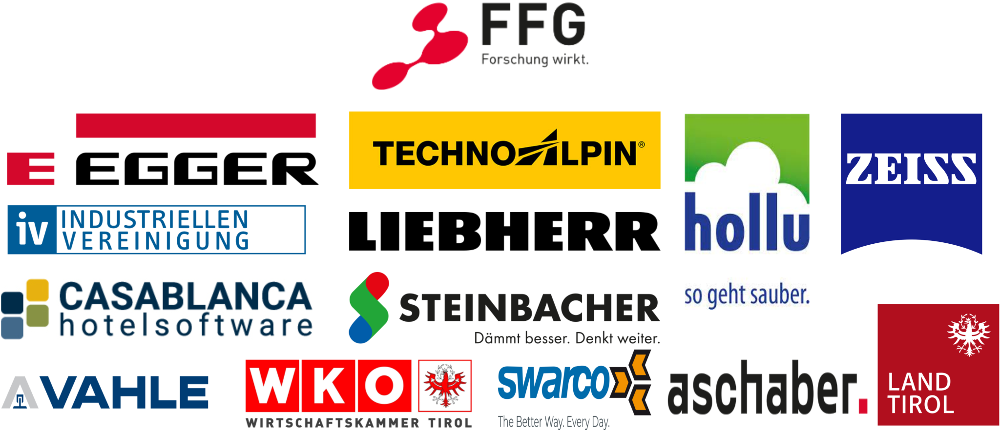

# UIBK Edge AI Website - Technical Documentation

**Version:** 1.0  
**Last Updated:** January 19, 2026  
**Maintainer:** T M Rayhan Gias  
**Base URL:** [edgeai-informatik.uibk.ac.at](https://edgeai-informatik.uibk.ac.at)  
**Repository:** [github.com/UIBK-Edge-AI/website](https://github.com/UIBK-Edge-AI/website)

---

## Table of Contents

1. [Project Overview](#1-project-overview)
2. [Technology Stack](#2-technology-stack)
3. [Project Structure](#3-project-structure)
4. [Configuration](#4-configuration)
5. [Page Types & Layouts](#5-page-types--layouts)
6. [Collections](#6-collections)
7. [Styling System](#7-styling-system)
8. [JavaScript Components](#8-javascript-components)
9. [Dark Mode System](#9-dark-mode-system)
10. [Content Management](#10-content-management)
11. [Development Workflow](#11-development-workflow)
12. [Deployment](#12-deployment)
13. [Troubleshooting](#13-troubleshooting)

---

## 1. Project Overview

The UIBK Edge AI website is a Jekyll-based static site for the Edge AI research group at the University of Innsbruck.

### Key Features

- Academic portfolio (team, publications, projects, courses)
- Light/dark theme toggle with system preference detection
- Mobile-first responsive design
- Custom Jekyll collections (team, projects, teaching, research)
- Automatic BibTeX publication management
- Interactive components (carousel, filters, search)

---

## 2. Technology Stack

### Core Technologies

- **Jekyll 4.x** - Static site generator
- **Liquid** - Templating engine
- **Sass/SCSS** - CSS preprocessing
- **JavaScript ES5** - Client-side interactivity
- **Markdown** - Content authoring
- **YAML** - Configuration and front matter

### Dependencies

```ruby
# Gemfile
gem "github-pages"
gem "jekyll-sitemap"
gem "jekyll-redirect-from"
gem "jemoji"
```

### Build Tools

- **Docker** - Containerized development
- **Bundler** - Ruby dependency management

---

## 3. Project Structure

```
website/
├── _config.yml              # Main Jekyll configuration
├── _data/                   # Data files (YAML/JSON)
│   ├── navigation.yml       # Site navigation menu
│   ├── authors.yml          # Author metadata
│   └── ui-text.yml          # Localization strings
├── _includes/               # Reusable HTML partials
│   ├── head.html
│   ├── footer.html
│   ├── masthead.html        # Navigation header
│   └── scripts.html
├── _layouts/                # Page templates
│   ├── default.html         # Base layout
│   ├── home.html            # Homepage
│   ├── team.html            # Team listing
│   ├── person.html          # Individual person
│   └── publications.html
├── _pages/                  # Static pages
│   ├── about.md             # Homepage content
│   ├── team.html
│   ├── publications.html
│   └── teaching.html
├── _sass/                   # SCSS stylesheets
│   ├── _themes.scss         # Theme variables
│   ├── theme/
│   │   ├── _default.scss    # Light theme
│   │   └── _dark.scss       # Dark theme
│   └── pages/
│       └── _home.scss
├── _team/                   # Team member profiles
├── _projects/               # Research projects
├── _teaching/               # Course listings
├── _research/               # Theses and internships
├── assets/
│   ├── css/                 # Compiled and page-specific CSS
│   └── js/                  # JavaScript files
├── images/                  # Content images
│   ├── homepage/
│   ├── logo/
│   └── themes/
├── files/
│   └── bibtex.bib          # Publications database
├── _plugins/
│   └── bibtex_reader.rb    # Custom BibTeX parser
├── docker-compose.yaml
└── serve_local.sh
```

---

## 4. Configuration

### Main Configuration (`_config.yml`)

#### Basic Settings

```yaml
title: ""
description: "Smart Computing Where It Matters"
baseurl: ""
repository: "https://github.com/UIBK-Edge-AI/website"
locale: "en-US"
site_theme: "default"  # or "dark"
```

#### Author Settings

```yaml
author:
  avatar: "winter1.png"
  name: "EDGE AI"
  bio: "Smart Computing Where It Matters"
  location: "Technikerstraße 21a, Innsbruck"
  telephone: "+43 512 507-53494"
  email: "edgeai-informatik(at)uibk(dot)ac(dot)at"
```

#### Collections

```yaml
collections:
  teaching:
    output: true
    permalink: /:collection/:path/
  projects:
    output: true
    permalink: /:collection/:path/
  team:
    output: true
    permalink: /:collection/:path/
  research:
    output: true
    permalink: /:collection/:path/
```

#### Publication Categories

```yaml
publication_category:
  books:
    title: 'Books'
  manuscripts:
    title: 'Journal Articles'
  conferences:
    title: 'Conference Papers'
```

---

## 5. Page Types & Layouts

### 5.1 Homepage

**File:** `_pages/about.md`  
**Layout:** `home.html`  
**Permalink:** `/`

#### Front Matter

```yaml
---
permalink: /
layout: home
title: ""
author_profile: true
research_topics_image: "edge_computing.png"
acknowledgments_image: "stiftung_edgeai.svg"
carousel_images:
  - image: "christmas_market_2025.jpg"
    caption: "Edge AI visits Innsbruck christmas market"
  - image: "spontaneous_x-mas_dinner.jpeg"
    caption: "Spontaneous Edge AI Xmas dinner"
---
```

#### Features

- Auto-playing image carousel (3s interval)
- Research topics section with floating image
- Acknowledgments with inverted logo for dark mode
- Responsive grid layout

#### Image Locations

- Carousel images:      `images/homepage/`
- Research topics:      `images/homepage/`
- Acknowledgments logo: `images/logo/`

---

### 5.2 Team Page

**File:** `_pages/team.html`  
**Layout:** `team.html`  
**Permalink:** `/team/`

#### Features

- Categorized team members (Professor, PhD Students, etc.)
- Sorted by `identifier` field within categories
- Person cards with photos and contact information
- Links to individual profile pages

#### Team Member Front Matter

```yaml
---
layout: person
title: "Univ.-Prof. Dr. Radu Prodan"
identifier: 1
category: PROFESSOR
img: /assets/img/team/photo.jpg
email: radu.prodan@uibk.ac.at
phone: +43 512 507-53249
office: ICT 3S06
ORCID: 0000-0002-8247-5426
LinkedIn: radu-prodan-182812b1
interests:
  - Distributed and Parallel Systems
  - Cloud/Edge/Fog Computing
positions:
  - from: 2025
    title: University Professor
    inst: University of Innsbruck
---
```

#### Team Categories (in order)

1. `PROFESSOR`
2. `POSTDOCTORAL RESEARCHERS`
3. `PhD STUDENTS`
4. `SECRETARY`
5. `SYSTEMS ENGINEER`
6. `STUDENT`
7. `FORMER MEMBER`

---

### 5.3 Publications Page

**File:** `_pages/publications.html`  
**Layout:** `publications.html`  
**Permalink:** `/publications/`

#### Features

- Automatic parsing from `files/bibtex.bib`
- Categorized by publication type
- Color-coded badges
- Collapsible abstracts
- BibTeX export links
- DOI links

#### BibTeX Entry Format

```bibtex
@article{authorYear,
  author    = {Last, First and Second, Author},
  title     = {Paper Title},
  journal   = {Journal Name},
  year      = {2025},
  volume    = {10},
  number    = {2},
  pages     = {1--15},
  doi       = {10.1234/example},
  abstract  = {Optional abstract text}
}
```

#### Publication Type Mapping

- `@article` → Journal Articles
- `@inproceedings` → Conference Papers
- `@book` → Books
- `@incollection` → Book Chapters

---

### 5.4 Projects Page

**File:** `_pages/projects.html`  
**Layout:** `projects.html`  
**Permalink:** `/projects/`

#### Features

- Table view with acronym, title, sponsor, duration
- Links to detailed project pages
- Sorted by duration (newest first)

#### Project Front Matter

```yaml
---
name: Edge AI
collection: projects
identifier: aim_edgeai
status: ongoing
sponsor: Austrian Research Promotion Agency (FFG)
title: AIM AT Endowed Professorship
duration: 2025 – 2030
website: https://www.ffg.at/aim
permalink: /projects/aimAtEdgeAI
---
```

---

### 5.5 Teaching Page

**File:** `_pages/teaching.html`  
**Permalink:** `/teaching/courses/`

#### Features

- Real-time search functionality
- Filter by title, instructor, degree, semester
- Responsive table layout
- Degree badge system

#### Course Front Matter

```yaml
---
title: "Introduction to Graph AI"
collection: teaching
type: "Lecture"
permalink: /teaching/WS25_26_intro_graph_ai
instructor: "Univ.-Prof. Dr. Radu Prodan"
semester: "WS 25/26"
degree: "Bachelor, Master"
room: "ICT Lecture Hall"
---
```

---

### 5.6 Theses Page

**File:** `_pages/theses.html`  
**Permalink:** `/teaching/theses/`

#### Features

- Filter buttons (All, Bachelor, Master, Internship, Open)
- Card-based layout
- Status badges (Open, In Progress, Completed)

#### Thesis Front Matter

```yaml
---
title: "Bachelor Thesis Title"
collection: research
type: "bachelor"
status: "open"
supervisor: "Prof. Name"
permalink: /theses/bachelor-thesis-2025
---
```

---

## 6. Collections

### 6.1 Team (`_team/`)

**File Naming:** `firstname_lastname.md`

**Required Fields:**
- `title` - Full name with academic title
- `identifier` - Numeric ID for sorting
- `category` - Team category (see 5.2)
- `img` - Profile image path
- `email` - Contact email

**Optional Fields:**
- `phone`, `office`, `ORCID`, `LinkedIn`
- `interests` - List of research areas
- `positions` - Work history

---

### 6.2 Projects (`_projects/`)

**File Naming:** `1_project_name.md` (number prefix for sorting)

**Required Fields:**
- `name` - Project acronym
- `title` - Full project title
- `sponsor` - Funding organization
- `duration` - Time period

---

### 6.3 Teaching (`_teaching/`)

**File Naming:** `SEMESTER_TYPE_course_name.md` or folder structure

**Required Fields:**
- `title` - Course name
- `semester` - e.g., "WS 25/26"
- `instructor` - Professor name
- `degree` - "Bachelor", "Master", or "Bachelor, Master"

---

## 7. Styling System

### 7.1 SCSS Architecture

**Entry Point:** `assets/css/main.scss`

```scss
@import
  "vendor/breakpoint/breakpoint",   // Grid system
  "themes",                         // Theme variables
  "theme/default",                  // Light theme
  "theme/dark",                     // Dark theme
  "include/mixins",                 // Utility mixins
  "layout/reset",                   // CSS reset
  "layout/base",                    // Base styles
  "layout/masthead",                // Navigation
  "layout/footer",                  // Footer
  "layout/sidebar",                 // Sidebar
  "pages/home";                     // Homepage
```

---

### 7.2 CSS Variables

#### Light Theme (`_sass/theme/_default.scss`)

```scss
:root {
  --global-bg-color: #fff;
  --global-text-color: #{$dark-gray};
  --global-link-color: #52adc8;
  --global-border-color: #{$lighter-gray};
}
```

#### Dark Theme (`_sass/theme/_dark.scss`)

```scss
html[data-theme="dark"] {
  --global-bg-color: #474747;
  --global-text-color: #ffffff;
  --global-link-color: #0ea1c5;
  --global-border-color: #{$light-gray};
}
```

---

### 7.3 Page-Specific Stylesheets

Located in `assets/css/`:

- `team.css` - Team page grid and cards
- `publications.css` - Publication badges and layout
- `teaching.css` - Course table and filters
- `theses.css` - Thesis cards and filters
- `person-profiles.css` - Individual person pages
- `project.css` - Project listing table

**Usage in Pages:**

```html
---
layout: archive
---
<link rel="stylesheet" href="{{ '/assets/css/team.css' | relative_url }}">
```

---

### 7.4 Carousel Styles

**Location:** `_sass/pages/_home.scss` (lines 207-435)

**Key Classes:**
- `.carousel-container` - Wrapper
- `.carousel-slide` - Individual slide
- `.carousel-btn` - Navigation arrows
- `.carousel-dot` - Pagination dots

**Dark Mode Variants:**

```scss
html[data-theme="dark"] {
  .carousel-container {
    box-shadow: 0 4px 20px rgba(0, 0, 0, 0.3);
  }
  .carousel-wrapper {
    background: #2a2a2a;
  }
}
```

---

## 8. JavaScript Components

### 8.1 Theme Toggle System

**Location:** `_includes/scripts.html`

#### Functions

- `setTheme(theme)` - Apply theme (light/dark)
- `toggleTheme()` - Switch between themes
- `updateLogo(isDark)` - Swap logo based on theme

#### Storage

```javascript
localStorage.setItem("theme", "dark");
localStorage.getItem("theme");
```

#### Theme Detection

```javascript
const browserPref = window.matchMedia('(prefers-color-scheme: dark)').matches 
  ? 'dark' 
  : 'light';
const use_theme = theme || localStorage.getItem("theme") || browserPref;
```

---

### 8.2 Image Carousel

**File:** `assets/js/image-carousel.js`

#### Initialization

- Triggers on `DOMContentLoaded`
- Data source: `window.carouselImages` (set by Jekyll)

#### Features

- Auto-play with 3-second interval
- Pause on hover
- Manual navigation (arrows, dots)
- Keyboard support (arrow keys)

#### Key Functions

```javascript
initCarousel()              // Entry point
buildCarouselHTML(images)   // Generate HTML
setupCarouselControls()     // Attach event listeners
showSlide(index)            // Display slide
nextSlide()                 // Next slide
previousSlide()             // Previous slide
```

---

### 8.3 Teaching Filter

**File:** `assets/js/teaching-filter.js`

#### Features

- Real-time search
- Degree badge filtering
- Semester filtering

#### Event Listeners

```javascript
document.getElementById('searchInput')
  .addEventListener('input', filterCourses);
```

---

### 8.4 Theses Filter

**File:** `assets/js/theses-filter.js`

#### Filter Buttons

- `data-filter="all"` - Show all
- `data-filter="bachelor"` - Bachelor theses
- `data-filter="master"` - Master theses
- `data-filter="praktikum"` - Internships
- `data-filter="open"` - Open positions

---

## 9. Dark Mode System

### 9.1 Implementation

#### HTML Attribute

```html
<html data-theme="dark">
```

#### CSS Targeting

```scss
html[data-theme="dark"] {
  .element {
    /* dark mode styles */
  }
}
```

#### Logo Switching

```javascript
window.updateLogo = function(isDark) {
  const logo = document.getElementById("site-logo");
  logo.src = isDark ? logo.dataset.dark : logo.dataset.light;
};
```

**Logo Data Attributes:**

```html

```

---

### 9.2 Image Compatibility

**Acknowledgments Logo Dark Mode Fix:**

```scss
html[data-theme="dark"] .acknowledgments-img {
  filter: invert(1);
  mix-blend-mode: screen;
}
```

**Applied To:**

```html

```

---

## 10. Content Management

### 10.1 Add a Team Member

1. Create file: `_team/firstname_lastname.md`

2. Add front matter:

```yaml
---
layout: person
title: "Dr. Name"
identifier: 10
category: PhD STUDENTS
img: /assets/img/team/photo.jpg
email: name@uibk.ac.at
phone: +43 512 507-XXXXX
office: ICT 3XXX
interests:
  - Topic 1
  - Topic 2
---
```

3. Add biography in Markdown body
4. Place photo in `assets/img/team/`

---

### 10.2 Add a Project

1. Create file: `_projects/X_project_name.md` (X = sorting number)

2. Add front matter:

```yaml
---
name: PROJECT
collection: projects
identifier: unique_id
status: ongoing
sponsor: Funding Agency
title: Full Project Title
duration: 2025 – 2030
website: https://project.url
permalink: /projects/project_name
---
```

3. Add project description in Markdown

---

### 10.3 Add a Course

1. Create file: `_teaching/SEMESTER_course_name.md`

2. Add front matter:

```yaml
---
title: "Course Title"
collection: teaching
type: "Lecture"
instructor: "Prof. Name"
semester: "WS 25/26"
degree: "Bachelor, Master"
room: "ICT Room"
---
```

3. Add course details in Markdown

---

### 10.4 Add a Publication

1. Open `files/bibtex.bib`

2. Add BibTeX entry:

```bibtex
@article{authorYear,
  author   = {Last, First and Second, Author},
  title    = {Paper Title},
  journal  = {Journal Name},
  year     = {2025},
  volume   = {10},
  pages    = {1--15},
  doi      = {10.1234/example},
  abstract = {Optional abstract text}
}
```

3. Rebuild site (Jekyll parses BibTeX automatically)

---

### 10.5 Update Carousel Images

1. Add images to `images/homepage/`

2. Edit `_pages/about.md` front matter:

```yaml
carousel_images:
  - image: "new_image.jpg"
    caption: "Image caption"
  - image: "another_image.jpg"
    caption: "Another caption"
```

---

## 11. Development Workflow

### 11.1 Local Development

#### Option 1: Docker (Recommended)

```bash
docker-compose up
# Visit http://localhost:4000
```

#### Option 2: Native Jekyll

```bash
bundle install
bundle exec jekyll serve --livereload
# Visit http://localhost:4000
```

#### Option 3: Using Script

```bash
chmod +x serve_local.sh
./serve_local.sh
```

---

### 11.2 File Watching

Jekyll automatically watches these directories:

- `_pages/`
- `_layouts/`
- `_includes/`
- `_sass/`
- `_team/`, `_projects/`, `_teaching/`, `_research/`
- `assets/css/`, `assets/js/`

**Note:** `_config.yml` changes require restart

---

### 11.3 Build Process

**Development Build:**

```bash
bundle exec jekyll build
```

**Production Build:**

```bash
JEKYLL_ENV=production bundle exec jekyll build
```

**Output:** `_site/` directory (ready for deployment)

---

## 12. Deployment

### 12.1 Nginx Configuration

```nginx
# HTTP to HTTPS redirect
server {
    listen 80;
    listen [::]:80;
    server_name edgeai-informatik.uibk.ac.at;
    return 301 https://$server_name$request_uri;
}

# HTTPS server
server {
    listen 443 ssl http2;
    server_name edgeai-informatik.uibk.ac.at;
    
    # Logs
    access_log /var/log/nginx/edgeai_access.log;
    error_log  /var/log/nginx/edgeai_error.log;
    
    # TLS configuration
    ssl_certificate /etc/letsencrypt/live/edgeai-informatik.uibk.ac.at/fullchain.pem;
    ssl_certificate_key /etc/letsencrypt/live/edgeai-informatik.uibk.ac.at/privkey.pem;
    include /etc/letsencrypt/options-ssl-nginx.conf;
    ssl_dhparam /etc/letsencrypt/ssl-dhparams.pem;
    
    # Proxy to Jekyll site
    location / {
        proxy_pass http://127.0.0.1:8080;
        proxy_set_header Host $host;
        proxy_set_header X-Real-IP $remote_addr;
        proxy_set_header X-Forwarded-For $proxy_add_x_forwarded_for;
        proxy_set_header X-Forwarded-Proto $scheme;
    }
    
    # Static assets with caching
    location ~* \.(css|js|png|jpg|jpeg|gif|ico|svg|woff2?|ttf|eot)$ {
        root /home/edgeai/website/_site;
        expires 5y;
        add_header Cache-Control "public, immutable";
    }
    
    # Security headers
    add_header Strict-Transport-Security "max-age=63072000" always;
    add_header X-XSS-Protection "1; mode=block" always;
    add_header X-Content-Type-Options "nosniff" always;
    add_header Content-Security-Policy "frame-ancestors 'self' https://apps.elfsight.com;" always;
    
    # Deny hidden files
    location ~ /\.(env|git|ht) { 
        deny all; 
    }
    
    # Error pages
    error_page 502 503 504 /50x.html;
    location = /50x.html { 
        root /usr/share/nginx/html; 
    }
}
```

---

### 12.2 Deployment Steps

1. Build production site:
   ```bash
   JEKYLL_ENV=production bundle exec jekyll build
   ```

2. Transfer `_site/` directory to server:
   ```bash
   rsync -avz _site/ user@server:/home/edgeai/website/_site/
   ```

3. Reload Nginx:
   ```bash
   sudo systemctl reload nginx
   ```

---

## 13. Troubleshooting

### 13.1 Common Issues

#### Carousel Not Showing

**Symptoms:** Carousel container empty or not visible

**Solutions:**
1. Check `window.carouselImages` is defined in browser console
2. Verify images exist in `images/homepage/`
3. Check browser console for JavaScript errors
4. Verify carousel initialization in `image-carousel.js`

---

#### Publications Not Loading

**Symptoms:** Publications page empty

**Solutions:**
1. Verify `files/bibtex.bib` exists
2. Check BibTeX syntax (balanced braces, proper formatting)
3. Rebuild site to re-parse BibTeX:
   ```bash
   bundle exec jekyll build
   ```
4. Check `_plugins/bibtex_reader.rb` for parsing errors

---

#### Dark Mode Not Working

**Symptoms:** Theme toggle has no effect

**Solutions:**
1. Check `localStorage.getItem("theme")` in browser console
2. Verify `html[data-theme="dark"]` attribute is applied
3. Check CSS variable definitions in `_sass/theme/_dark.scss`
4. Clear browser cache and localStorage

---

#### Team Members Not Sorted

**Symptoms:** Team members appear in wrong order

**Solutions:**
1. Ensure `identifier` field is numeric
2. Check `category` matches defined team categories
3. Verify sorting logic in `_layouts/team.html`:
   ```liquid
   
   ```

---

#### Images Not Loading

**Symptoms:** Broken image links

**Solutions:**
1. Use `{{ site.baseurl }}` for absolute paths
2. Check image file extensions (case-sensitive on Linux)
3. Verify image paths in browser DevTools
4. Check file permissions (should be 644)

---

### 13.2 Debug Mode

**Enable Verbose Logging:**

```bash
bundle exec jekyll serve --verbose
```

**Check Liquid Output:**

```liquid
 Debug variable 
{{ variable | inspect }}
```

---

### 13.3 File Permissions

**Recommended Permissions:**

- `_config.yml` - 644
- `Gemfile` - 644
- `serve_local.sh` - 755 (executable)
- `_plugins/*.rb` - 644
- Image files - 644
- Directories - 755

---

### 13.4 Browser Compatibility

**Supported Browsers:**

- Chrome/Edge 90+
- Firefox 88+
- Safari 14+
- Mobile Safari (iOS 14+)
- Chrome Mobile (Android 10+)

**JavaScript Features Used:**

- ES5 syntax (IE11 compatible)
- `querySelector`, `addEventListener`
- `localStorage`
- CSS Variables (with fallbacks)

---

## Support & Resources

### Documentation

- [Jekyll Documentation](https://jekyllrb.com/docs/)
- [Liquid Syntax](https://shopify.github.io/liquid/)
- [Sass Guide](https://sass-lang.com/guide)
- [GitHub Pages](https://docs.github.com/en/pages)

### Project Repository

- **GitHub:** [github.com/UIBK-Edge-AI/website](https://github.com/UIBK-Edge-AI/website)
- **Issues:** Report bugs and feature requests via GitHub Issues

### Contributors

- **Primary Maintainer:** T M Rayhan Gias
- **Team:** Edge AI Research Group, University of Innsbruck

---

**Document Version:** 1.0  
**Last Updated:** January 15, 2026
